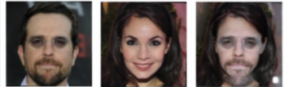
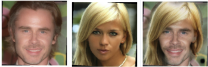
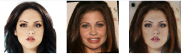
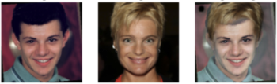
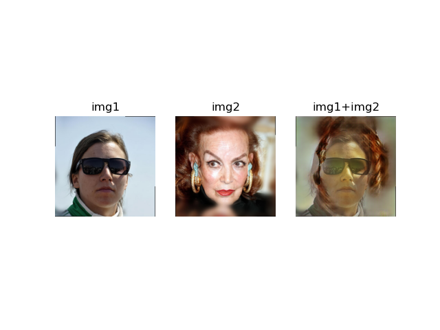
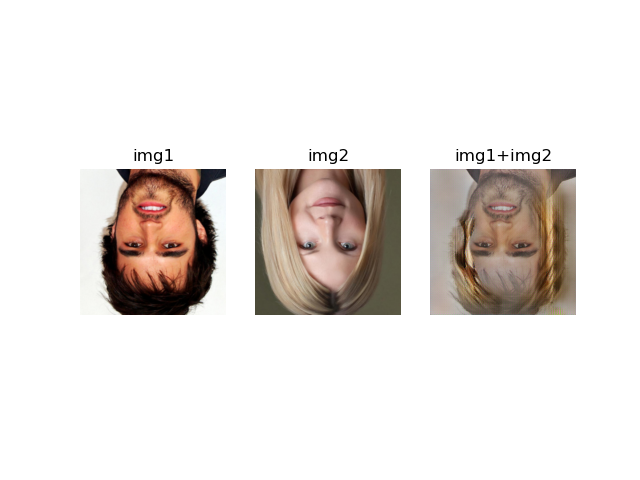
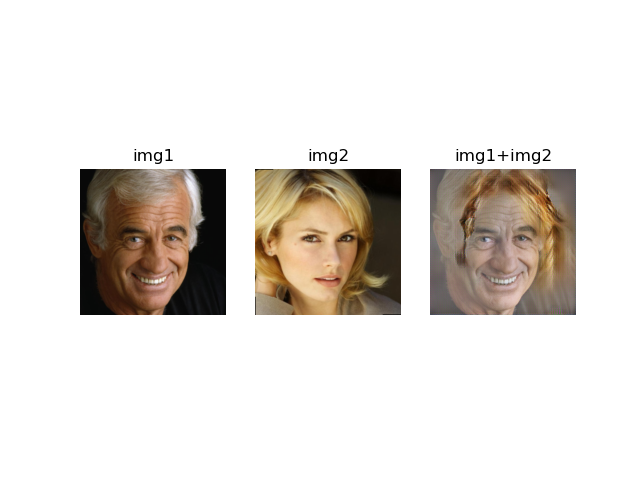
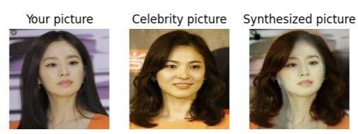

# ybigta-hair-styling
This repository is for recording YBIGTA 18th freshman project(Feb, 2021)

## Requirements

    python>=3.6
    numpy==1.19.4
    matplotlib==3.3.3
    opencv-python==4.5.1.48
    torch==1.17.0
    torchvision==0.8.1

## Train
There are 3 ways to train your hair styling application.

Note that you should change your argument ```--image_path``` in **configs.py** correctly!

For detailed descriptions, we recommend you to check **configs.py** in each directory.

### 1. Pix2Pix-Hair
    
    cd pix2pix-hair
    python main.py
    
#### sampled images during training








    
### 2. Pix2Pix-Skin and Hair

    cd pix2pix
    python main.py

#### sampled images during training








### 3. MichiGAN

## Evaluate

### 1. PixPix-Hair

    cd pix2pix-hair
    python inference.py --your_pic {your_img_path} --celeb_pic {celeb_img_path}
    
### Sample


    
### 2. PixPix-Skin and Hair

    cd pix2pix
    python inference.py --your_pic {your_img_path} --celeb_pic {celeb_img_path}

### 3. MichiGAN

<hr>

For pretrained resnet and generator, you can download them [here](https://drive.google.com/drive/u/0/folders/1rZOmFv0OaMbolPGBl1NBhz56Gn_C2c9H).
