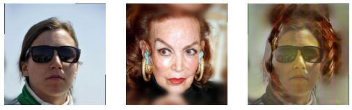
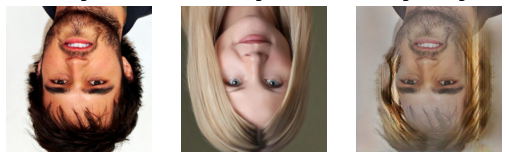
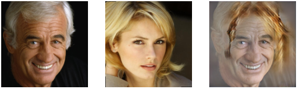

# ybigta-hair-styling
This repository is for recording YBIGTA 18th freshman project(Feb, 2021)

## Requirements

    python>=3.6
    numpy==1.19.4
    matplotlib==3.3.3
    opencv-python==4.5.1.48
    torch==1.17.0
    torchvision==0.8.1

## Train
There are 3 ways to train your hair styling application.

Note that you should change your argument ```--image_path``` in **configs.py** correctly!

For detailed descriptions, we recommend you to check **configs.py** in each directory.

### 1. Pix2Pix-Hair
    
    cd pix2pix-hair
    python main.py
    
#### sampled images during training


    
### 2. Pix2Pix-Skin and Hair

    cd pix2pix
    python main.py

#### sampled images during training








### 3. MichiGAN
        python train.py --name [name_experiment] --batchSize 8 --no_confidence_loss --gpu_ids 0,1,2,3,4,5,6,7 --no_style_loss --no_rgb_loss --no_content_loss --use_encoder --wide_edge 2 --no_background_loss --noise_background --random_expand_mask --use_ig --load_size 568 --crop_size 512 --data_dir [pah_to_dataset] ----checkpoints_dir ./checkpoints


## Evaluate

### 1. PixPix-Hair

    cd pix2pix-hair
    python inference.py --your_pic {your_img_path} --celeb_pic {celeb_img_path}
    
### Sample


    
### 2. PixPix-Skin and Hair

    cd pix2pix
    python inference.py --your_pic {your_img_path} --celeb_pic {celeb_img_path}

### 3. MichiGAN

    cd michigan
    python inference.py --name MichiGAN --gpu_ids 0 --inference_ref_name 60429 --inference_tag_name 56024 --inference_orient_name 60429 --netG spadeb --which_epoch 50 --use_encoder --noise_background --expand_th 5 --load_size 512 --crop_size 512 --add_feat_zeros --data_dir ./datasets/FFHQ_single --expand_tag_mask


<hr>

For pretrained resnet and generator, you can download them [here](https://drive.google.com/drive/u/0/folders/1rZOmFv0OaMbolPGBl1NBhz56Gn_C2c9H).
